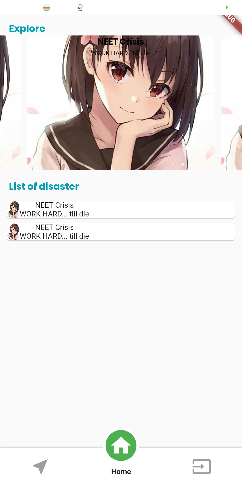
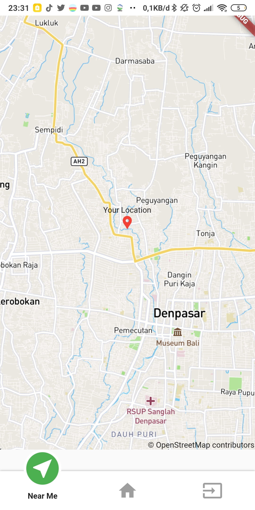

<h1 style="font-weight:bold; font-size:48px; background: linear-gradient(91.05deg, #1D7BC5 -10.71%, #779F25 117.06%);-webkit-background-clip: text;
-webkit-text-fill-color: transparent;
" align="center">Earth-chan</h1>

<h1 style="font-weight:bold; background: linear-gradient(91.05deg, #1D7BC5 -10.71%, #779F25 117.06%);-webkit-background-clip: text;
-webkit-text-fill-color: transparent; margin:4px; margin-top:40px;" align="center" >Feature</h1>

    

        <h3 align="center">View Event</h3>
        
    

    

        <h3 align="center">Near You</h3>
        
    

    

    <h3 align="center">Insert Event</h3>
    
    

<h1 style="font-weight:bold; background: linear-gradient(91.05deg, #1D7BC5 -10.71%, #779F25 117.06%);-webkit-background-clip: text;
-webkit-text-fill-color: transparent; margin:10px; margin-top:40px;" align="center">TechStack</h1>

    
 
        
    

    
 
        
    

    
 
        
    

<h1 style="font-weight:bold; background: linear-gradient(91.05deg, #1D7BC5 -10.71%, #779F25 117.06%);-webkit-background-clip: text;
-webkit-text-fill-color: transparent; margin:10px; margin-top:40px;" align="center">Credits</h1>

    
 
        <h2 style="font-weight:bold; background: linear-gradient(91.05deg, #1D7BC5 -10.71%, #779F25 117.06%);-webkit-background-clip: text;
-webkit-text-fill-color: transparent;" align="center" >Albertus Ivan</h2>
    

    
 
        <h2 style="font-weight:bold; background: linear-gradient(91.05deg, #1D7BC5 -10.71%, #779F25 117.06%);-webkit-background-clip: text;
-webkit-text-fill-color: transparent;" align="center" >Jeremi Herodian</h2>
    

    
 
        <h2 style="font-weight:bold; background: linear-gradient(91.05deg, #1D7BC5 -10.71%, #779F25 117.06%);-webkit-background-clip: text;
-webkit-text-fill-color: transparent;" align="center" >Sudimahendra</h2>
    

